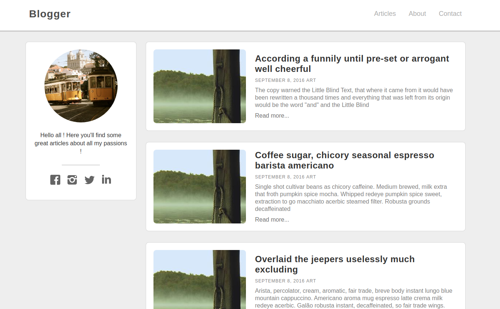
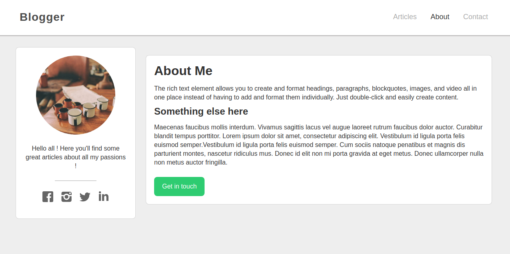

# Simple Blog MVC

## Description

This is a simple Blog built in PHP, design MVC (Twig for the views), SQL and MySQL for the database, pure CSS and Vanilla JS for the front. I used GrumPHP to sniff my code for a clean project.

You can watch articles, add some comments for each articles, navigate freely into the blog :)





## Steps

1. Clone the repo from Github.
2. Run `composer install`.
3. Create *config/db.php* from *config/db.php.dist* file and add your DB parameters.
```php
define('APP_DB_HOST', 'your_db_host');
define('APP_DB_NAME', 'your_db_name');
define('APP_DB_USER', 'your_db_user_wich_is_not_root');
define('APP_DB_PWD', 'your_db_password');
```
4. Import `simple-mvc.sql` in your SQL server,
5. Run the internal PHP webserver with `php -S localhost:8000 -t public/`. The option `-t` with `public` as parameter means your localhost will target the `/public` folder.
6. Go to `localhost:8000` with your favorite browser.


